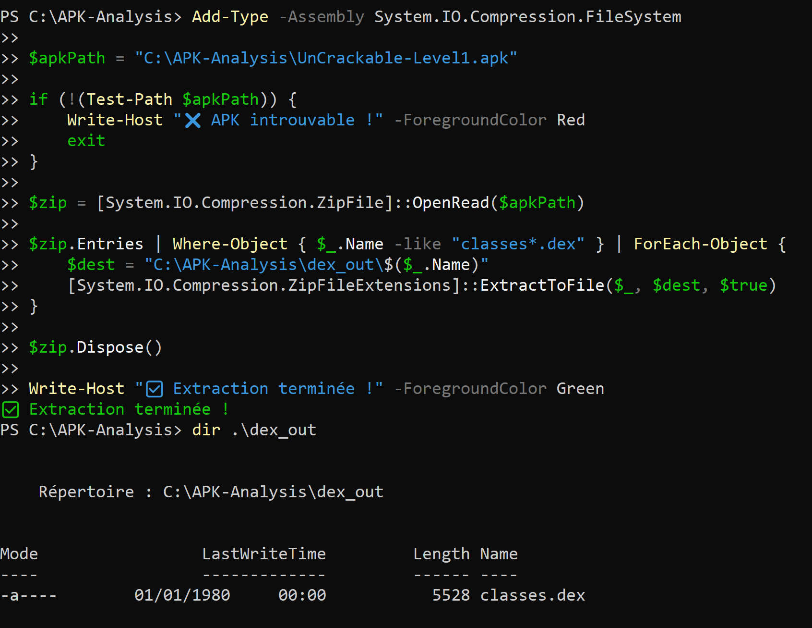
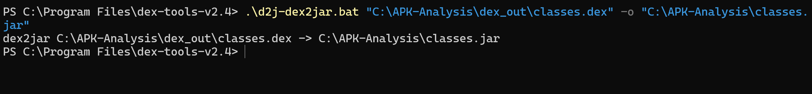
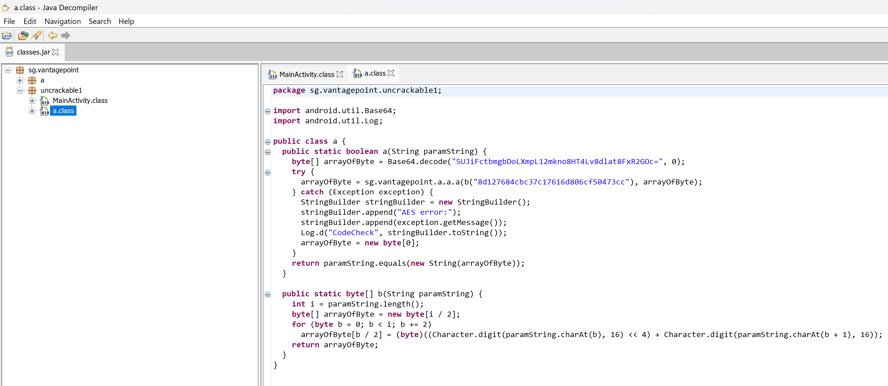
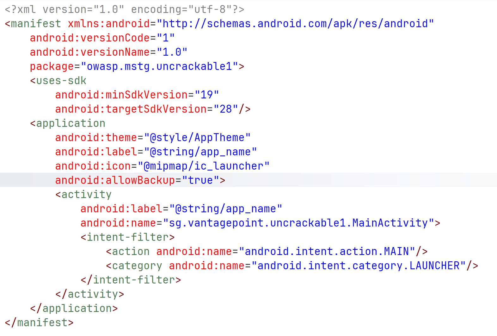
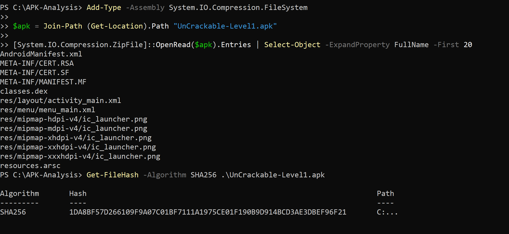
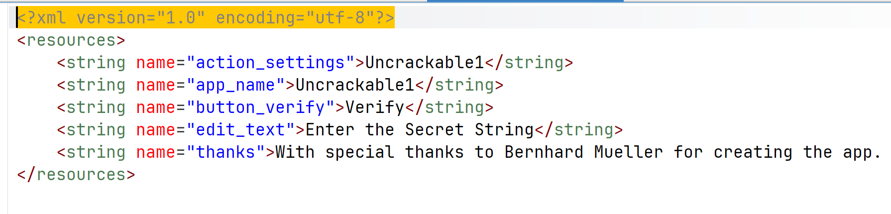
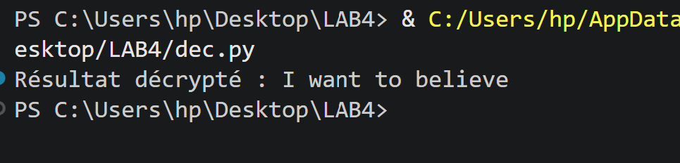

# OWASP Uncrackable Level 1 - Write-up

## Objectif
Trouver la chaîne secrète cachée dans l'application OWASP Uncrackable Level 1.

---

## 1. Étape 1 : Extraction et Conversion du DEX en JAR

La première étape consiste à extraire le fichier DEX de l'APK et le convertir en format JAR pour le décompiler.



Ensuite, nous utilisons un outil de conversion DEX to JAR pour transformer le fichier DEX en JAR:



---

## 2. Étape 2 : Décompilation avec JD-GUI

Une fois le fichier JAR obtenu, nous l'ouvrons avec **JD-GUI** pour décompiler le code bytecode en code source Java lisible.



---

## 3. Étape 3 : Analyse du Manifeste (obtener par jadx)

Nous examinons le fichier **AndroidManifest.xml** pour comprendre la structure de l'application et identifier les activités principales.



---

## 4. Étape 4 : Inspection des Ressources

Les ressources de l'application (fichiers XML, chaînes, etc.) peuvent contenir des indices importants.



---

## 5. Étape 5 : Recherche de Chaînes Intéressantes

Nous utilisons des outils comme **strings** pour extraire et rechercher des chaînes de caractères significatives dans le binaire.



---

## 6. Étape 6 : Découverte du Mécanisme de Chiffrement

En analysant le code décompilé, nous découvrons le mécanisme de chiffrement utilisé. Il s'agit d'un chiffrement AES en mode ECB.


---

## 7. Étape 7 : Exécution de l'Exploit

Avec les informations collectées (clé AES et données chiffrées), nous créons un script Python pour déchiffrer la chaîne secrète.

### Script de Décryption

```python
from Crypto.Cipher import AES
import base64

def decrypt_vantage_point():
    key_hex = "8d127684cbc37c17616d806cf50473cc"
    key = bytes.fromhex(key_hex)
    data_b64 = "5UJiFctbmgbDoLXmpL12mkno8HT4Lv8dlat8FxR2GOc="
    ciphertext = base64.b64decode(data_b64)
    try:
        cipher = AES.new(key, AES.MODE_ECB)
        decrypted = cipher.decrypt(ciphertext)
        padding_len = decrypted[-1]
        clean_text = decrypted[:-padding_len]
        print(f"Résultat décrypté : {clean_text.decode('utf-8', errors='ignore')}")
    except Exception as e:
        print(f"Erreur lors du décryptage : {e}")

if __name__ == "__main__":
    decrypt_vantage_point()
```

---

## 8. Étape 8 : Résultat Final

Exécution du shell pour obtenir la chaîne secrète:



---

## Résumé de la Méthodologie

1. **Extraction** : Extraire le DEX de l'APK
2. **Conversion** : Convertir DEX en JAR
3. **Décompilation** : Utiliser JD-GUI pour obtenir le code source
4. **Analyse Statique (jadx)** : Examiner le code pour identifier le mécanisme de chiffrement
5. **Extraction des Secrets** : Trouver la clé de chiffrement et les données chiffrées
6. **Décryptage** : Créer un script pour déchiffrer la chaîne secrète
7. **Validation** : Exécuter le script et confirmer le résultat

---

## Concepts de Sécurité Apprendre

- **Décompilation d'Applications Android** : Comment les APK peuvent être facilement analysées
- **Chiffrement AES en Mode ECB** : Pourquoi ce mode n'est pas recommandé en production
- **Stockage de Secrets** : Ne jamais stocker les clés de chiffrement en dur dans le code
- **Sécurité Reverse Engineering** : L'importance d'obfusquer et de protéger les applications mobiles

---

## Mitigation

Pour sécuriser une application :
- ✓ Utiliser des modes de chiffrement sécurisés (CBC, CTR)
- ✓ Stocker les clés dans un stockage sécurisé du système
- ✓ Obfusquer le code avec ProGuard/R8
- ✓ Implémenter la détection de root/jailbreak
- ✓ Utiliser des techniques anti-tampering

---

**Challenge Status**: ✓ Complété  
**Difficulté**: Facile - Focus sur les bases du reverse engineering mobile
